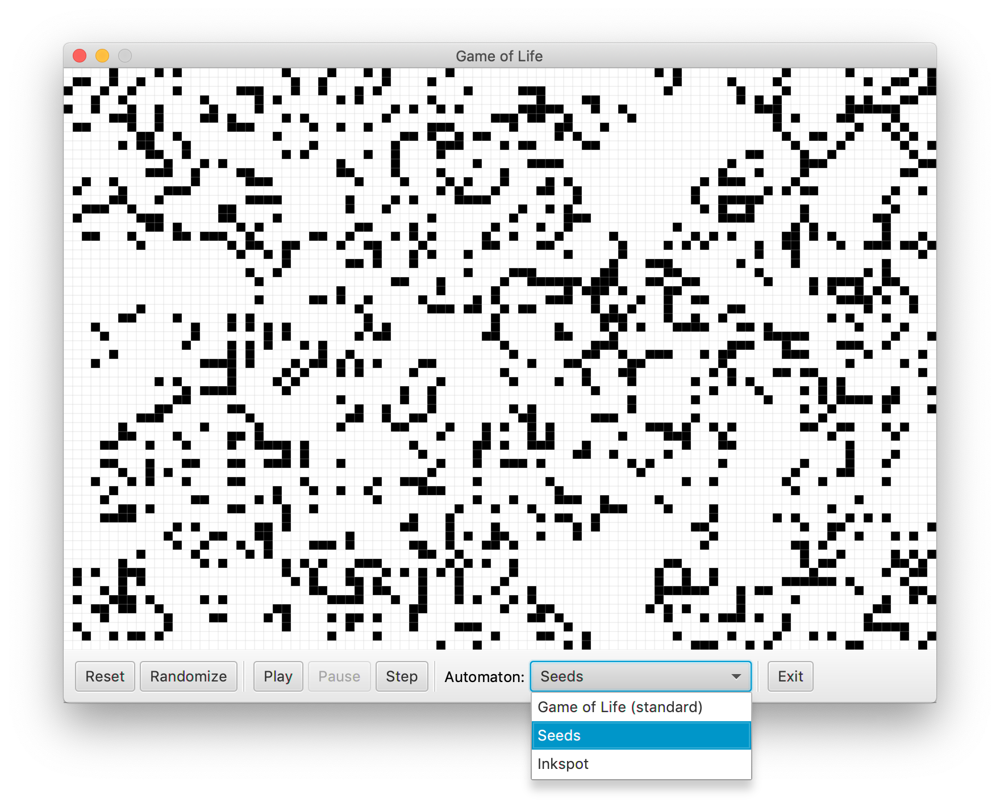

# Game of Life

Implementations of various cellular automatons, including Conway's Game of Life and a some of its variations, powered by JavaFX GUI.



Includes implementations of following [automatons](https://en.wikipedia.org/wiki/Life-like_cellular_automaton):

- [Game of Life (standard)](https://en.wikipedia.org/wiki/Conway%27s_Game_of_Life)
- [Seeds](https://en.wikipedia.org/wiki/Seeds_(cellular_automaton))
- [Inkspot or Life without Death](https://en.wikipedia.org/wiki/Life_without_Death) 

Simulation can be paused, resumed and reset at any time. Step-by-step simulation is also included. The grid can be interacted with using mouse, allowing activation of arbitrary cells, including random grid-fill. Automatons can be switched at any time while the simulation is paused.

## Prerequisites

- Java 12+
- JavaFX SDK 12+
- Maven

The project was tested on Ubuntu 18 and macOS 10.14 Mojave installation.

## Running

Project compilation lifecycle is managed by Maven, `exec-maven-plugin` and `javafx-maven-plugin`. To compile the project and execute it, run:

```bash
mvn package exec:java
```

### Notes on using IntelliJ IDEA

As of JDK 11, JavaFX is no longer part of standard Java library. Please follow [these steps](https://openjfx.io/openjfx-docs/#IDE-Intellij) for setting up your IntelliJ IDE for developing this repo. 

Here's the short summary:

- Download official JavaFX SDK 12+ from [this page](https://gluonhq.com/products/javafx/).
- Add it to the Project libraries in File -> Project Structure -> Libraries (use path to `javafx-sdk-12.xx/lib` folder).
- Add it to VM options for your Run configuration in Run -> Edit Configurations -> VM Options -> `--module-path /path/to/javafx-sdk-12.xx/lib --add-modules javafx.controls,javafx.fxml`.

## Further Development

- Dynamic grid and responsive layout (support resizable window)
- Add more automatons
- Various runtime optimizations

## Credits

This project was originally developed as an OOP/Java exercise for NYU Fundamentals of Computing course by Pavel Burakov.
